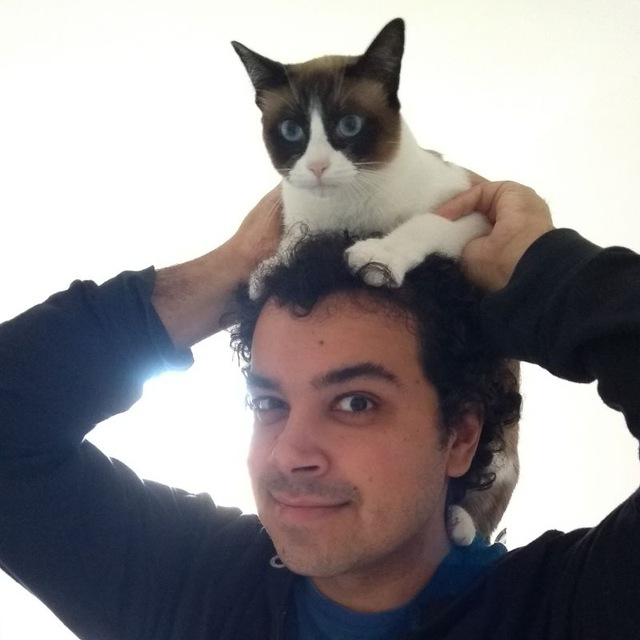

__Quem sou eu__

André Rocha (Soneca)

Não sei a quanto tempo codo, não lembro quando comecei.

Engenheiro de Software na Konker (https://www.konkerlabs.com/)

Linkedin: https://www.linkedin.com/in/andr%C3%A9-rocha-24831b15/

Github: https://github.com/sonecabr/

__Sobre quem colaborou__

Wellington Mariusso ( Well )

Coda desde de sempre, atua com sistemas criticos e de alta disponibilidade a mais de 15 anos.

CTO na Konker (https://www.konkerlabs.com)

Linkedin: https://www.linkedin.com/in/wmariusso/

Github: https://github.com/wmariusso/

__Sobre o workshop__

São 5 etapas, e o meu proposito é que cada etapa dure entre 1 a 2 horas.

__Primeira Etapa__

1 - Basico

2 - Executando o primeiro container

3 - Explorando o DockerHub

4 - Criando o primeiro container

5 - Publicando a primeira imagem

__Segunda Etapa__

6 - Docker Compose

7 - Criando a primeira receita de Compose

8 - Executando o primeiro Compose

9 - Docker machine

10 - Criando uma maquina na nuvem

__Terceira Etapa__

11 - Docker Swarm
12 - Criando um cluster Swarm
13 - Comandos úteis para gestão do cluster
14 - Criando um cluster via Docker Stack
15 - Conceitos adicionais para uma aplicação estável e tolerante a falhas

__Quarta Etapa__
WIP

__Quinta Etapa__
WIP

Quer me ajudar a definir as etapas finais? Gostaria de adicionar alguma informação? 
Gostaria de sugerir mudanças ou Etapas adicionais? 
Vou ficar muito feliz em receber Issues neste repositório com estas sugestões e críticas =D.
