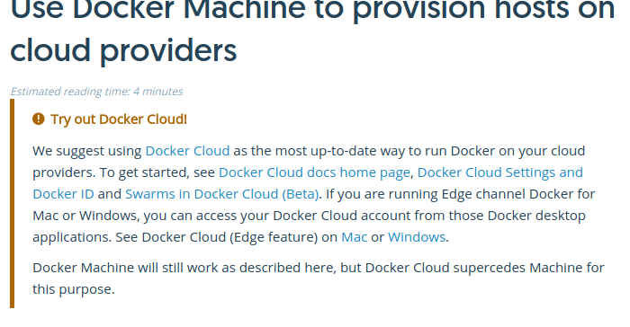

__Docker Machine__

O que é?
 - Docker machine é um utilitario do docker para automatizar a criação de maquinas na nuvem (ou em vms) pre configuradas para rodar containers docker. Com a Docker Machine é possível alem de criar, gerenciar essas maquinas remotamente.

É para ambiente produtivo?
 - Na minha opinião não, mas é ideal para criar ambientes de teste sob demanda para POC ou testes pointuais.

Tem como melhorar?
 - Sim, se você usar para provisionar um cluster swarm é possível ter Docker Machine em um ambiente produtivo.

Qual é a grande sacada então?
 - Caso você não queira usar um ferramental mais pesado para provisionar a infra na cloud (terraform e afins...), a Docker Machine fornece um jeito facil e efetivo para pequenos ambientes.

Como instalo?
  ```
  curl -L https://github.com/docker/machine/releases/download/v0.12.2/docker-machine-`uname -s`-`uname -m` >/usr/local/bin/docker-machine && \
  chmod +x /usr/local/bin/docker-machine
  ```
  Vamos agora validar:
  ```
   docker-machine version
  ```
  A saída esperada deve ser:
  ```
  docker-machine version 0.12.2, build 9371605
  ```
  Neste link tem a descrição detalhadas alem de alguns deep steps
  https://docs.docker.com/machine/install-machine/#how-to-uninstall-docker-machine
 
  Um disclaimer:
   - A propria docker vem incentivando os usuarios a migrar para a docker-cloud. Trata se de um serviço de cloud para containers docker da mesma criadora.
   - Não significa que a machine vai deixar de existir mas incentiva a comunidade a adotar outro tipo de ferramental
   