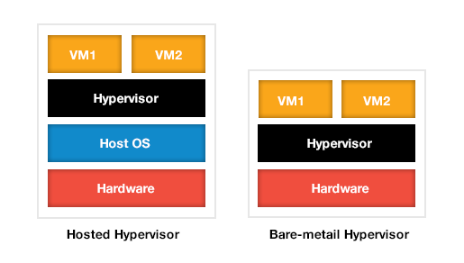

__Oque é Docker?__

# Um pouco de historória
  Um sr chamado Solomon Hykes iniciou o projeto na frança para a empresa dotCloud, usando a capacidade de gerar namespaces no Linux (LXC) para criar containers.
  Em 2013 o projeto foi anunciado ao publico na PyCon.
  Em março de 2013 o projeto foi doado a comunidade
  Até 2017 o Docker ja possuia mais de 13 bilhoes de downloads na pagina oficial.

# Docker x Virtualização
  A comparação mais comun que se faz é entre Docker e Virtualização. Apesar de não terem praticamente nenhuma similaridade, o Docker tem roubado uma parte consideravel da atenção do mercado em detrimento da Virtualização, por resolver na essencia o mesmo tipo de problema (Compartilhamento de recurso).
  O desenho mais comum que se encontra para tal comparação é este:
  

# Como um container nasce
  Toda instancia de container nasce a partir de uma imagem, que por sua vez é criada a partir de um Dockerfile.

# O que é Docker image
  Docker image é um binario criado a partir de um Dockerfile, este binario possui toda a configuração e dependencias necessários para lançar instancias de container

# O que é Dockerfile
  Dockerfile é uma receita que possui os passos para a criação de uma Docker image
  Todo Dockerfile é composto inicialmente por 3 componentes:
   - A imagem de base
   - O script de instalação
   - O comando de execução

# Como instalar Docker
  É possivel instalar o Docker a partir do repositorio da maioria dos sistemas linux
   * Ubuntu: ``` sudo apt-get install docker```
   * Fedora: ``` sudo yum install docker```
  
  Ou baixando os binarios na pagina oficial do docker:
    * https://docker.com/
  Existe docker para Windows?
     - Sim, existe mas tem suporte limitado
  Existe docker para Mac
     - Sim =D. https://www.docker.com/docker-mac

# Como validar a instalação do Docker
  Basta executar o comando:
    ``` sudo docker info```
  Caso tudo ocorra conforme o esperado ele deverá mostrar algo parecido com:
  ```
Containers: 60
 Running: 1
 Paused: 0
 Stopped: 59
Images: 1280
Server Version: 17.06.0-ce
Storage Driver: aufs
 Root Dir: /var/lib/docker/aufs
 Backing Filesystem: extfs
Dirs: 1151
...
```

# Comandos basicos do Docker

Manual e ajuda:
```
sudo docker --help
```

Verificando a versão:
```
sudo docker version
```

Listando as imagens disponiveis
```
sudo docker images
```

Listando os containers em execução
```
sudo docker ps
```

Listando todos os containers
```
sudo docker ps -a
```

Limpando a casa:
```
sudo docker container prune
sudo docker images prune

sudo docker rm $(sudo docker ps -aq)
sudo docker rmi $(sudo docker images -f status=exited -q)
```


  