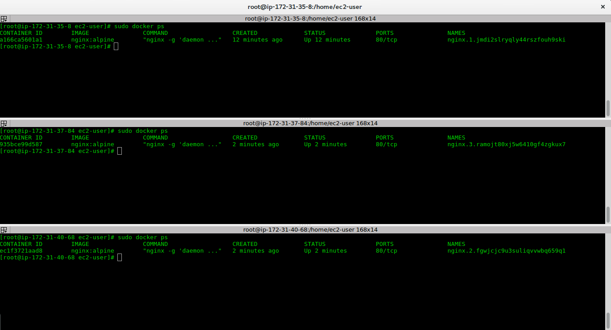

__Comandos uteis para gestão do Cluster Swarm__


Agora que criamos o nosso cluster, que tal fazer o deploy de algumas instancias?
```
sudo docker service create --name nginx --publish 80:80 nginx:apine
```
O que é o --name?
 - É o nome que você quer dar ao serviço

O que é o --publish?
 - É a porta em que o serviço será exposto, sendo que o padrão é PORTA_PUBLICA:PORTA_DO_CONTAINER

E como valido se deu certo?
```
sudo docker service ls
```
Você deve ver algo similar a isso:
```
ID                  NAME                MODE                REPLICAS            IMAGE               PORTS
w7641ncm2zi4        nginx               replicated          0/1                 nginx:apine         *:80->80/tcp
```
E o que é REPLICAS?
 - Na prática é o numero de instancias que estão rodando o serviço, note que temos 0 instancias, o que nos diz que o serviço ainda não está disponivel.

E como eu altero o numero de replicas?
```
sudo docker service scale nginx=1
```

O resultado deve ser similar a:
```
nginx scaled to 1
```
Como valido?
```
sudo docker service ls
```
O resultado deve ser:
```
bvxhhv3vrt5d        nginx               replicated          1/1                 nginx:alpine        *:80->80/tcp
```
```
sudo docker service ps nginx
```
O resultado deve ser:
```
ID                  NAME                IMAGE               NODE                DESIRED STATE       CURRENT STATE                ERROR               PORTS
jmdi2slryqly        nginx.1             nginx:alpine        ip-172-31-35-8      Running             Running about a minute ago                       

```
Tem como escalar mais?
```
sudo docker service scale nginx=3
```
O resultado deve ser:
```
ID                  NAME                IMAGE               NODE                DESIRED STATE       CURRENT STATE            ERROR               PORTS
jmdi2slryqly        nginx.1             nginx:alpine        ip-172-31-35-8      Running             Running 10 minutes ago                       
fgwjcjc9u3su        nginx.2             nginx:alpine        ip-172-31-40-68     Running             Running 3 seconds ago                        
ramojt80xj5w        nginx.3             nginx:alpine        ip-172-31-37-84     Running             Running 3 seconds ago    
```
Ele jogou uma instancia em cada nó?:
 - Sim

E qual a motivação?
 - Resiliencia e Alta disponibilidade, todo orchestrador de Docker rodando em modo replicação parte do principio que você está escalando serviços de forma a obter maior resiliencia, sendo que um dos artifícios para tal é distribuir o workload da forma mais espalhada possível.

E como verifico?
 - Entre em cada instancia e execute o nosso já conhecido:
  ```
  sudo docker ps
  ```
  O resultado será apenas uma instancia por nó:
  

E afinal, como acesso o serviço?
curl -v http://{IP_DO_SERVIDOR} ou apenas acessando pelo browser http://{IP_DO_SERVIDOR}


Eu consigo acessar de qualquer nó?
 - Sim

E se eu escalar para 1?
 - Vamos testar :D
 ```
 sudo docker service scale nginx=1
 ```

É possivel notar que ele escolheu arbitrariamente um dos nós para manter a instancia
```
ID                  NAME                IMAGE               NODE                DESIRED STATE       CURRENT STATE            ERROR               PORTS
fgwjcjc9u3su        nginx.2             nginx:alpine        ip-172-31-40-68     Running             Running 28 minutes ago                       

```
E por que isso acontece?
Frase do meu amigo Well:
` Trate as maquinas na nuvem como gado e não como bichinho de estimação`

Como assim?
 - Uma das principais vantagens de implantar em nuvem ( sim, docker é focado em nuvem, apesar de poder ser usado tranquilamente em outros modelos ) é a elasticidade, ou seja, não vale a pena ter muito apena a nós e a melhor forma de fazer isso é distribuir os seus recursos da forma mais granular possível

Então eu devo usar os menores nós possiveis e implantar o minimo de instancias em cada nó?
 - Idealmente sim =D.

Mas não vai dar trabalho operar e manter tudo isso?
 - Sim, mas os orquestradores estão evoluindo rápido no sentido de ajudar a operar ambientes grandes, ou seja, use orquestradores, evite operar docker no braço em ambientes produtivos.

Mas a Docker engine trava muito?
 - Não, mas quando travar você vai querer ter tratado as máquinas como gado e não como bichinho de estimação.


