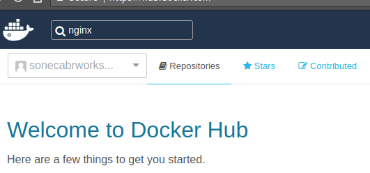
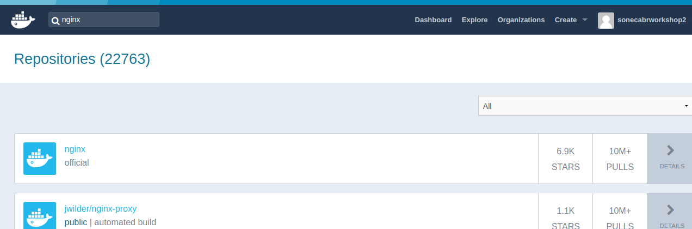
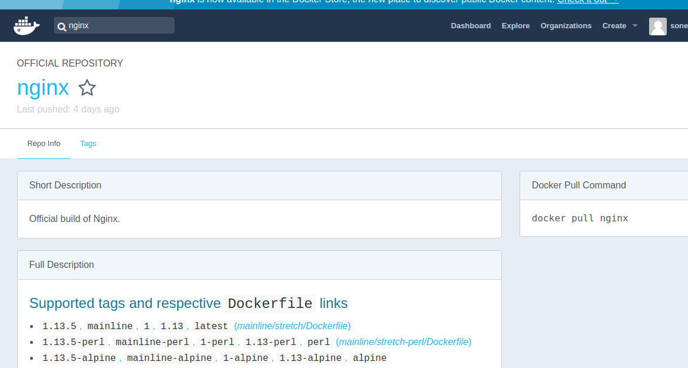
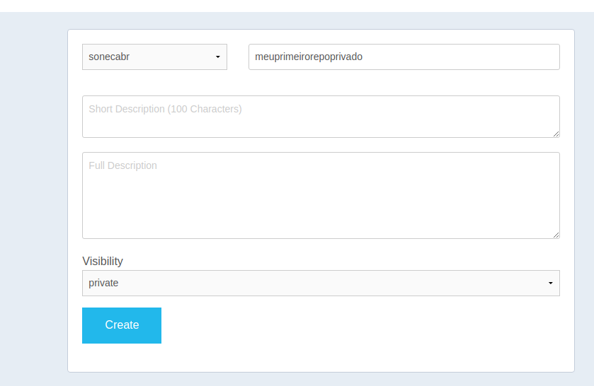

__Explorando o DockerHhub__

O que é o Dockerhub?
 - Dockerhub é o repositorio oficial do docker, ele é construido em cima do DockerRegistry e possui uma dashboard amigavel.
Quanto custa?
 - Nada, desde que você deixe suas imagens publicas, sendo que uma delas pode ser privada
Posso pagar e ter imagens privadas?
 - Sim! As assinaturas possuem um valor extremamente baixo pelo que entrega, aproximadamente 1 dolar por repositorio privado.
E como acesso? 
 - https://hub.docker.com/

Vamos criar uma conta para explorar um pouco:
 - Basta preencher os dados do forumulario da pagina inicial:
 

Após criar a conta, basta confirmar no link do email enviado a ativação e logar na sua conta.
A tela inicial se parece com esta:


Vamos agora explorar um pouco.

No campo de busca, digite ```nginx```

Você verá uma tela parecida com essa no resultado;

E aṕos clicar no primeiro item verá a seguinte tela:


Este é o link caso tenha dificuldades para encontrar o repositorio:
https://hub.docker.com/_/nginx/

O que é essa pagina?
 - É um dos repositórios de alguem, neste caso o repositorio oficial do nginx.
Como assim oficial?
 - O Dockerhub possui contas assinadas para projetos grandes, é facil identificar um repositoio oficial pela estrutura da url, repositorios oficiais não possuem usuario, repositorios não oficiais possuem:
 https://hub.docker.com/_/nginx/ este é um repositorio oficial
 https://hub.docker.com/r/sonecabr/marathonlb/ este é um repositorio de um usuário comum

Como sei que um repositorio é confiavel?
 - Infelizmente não tem como garantir que um repositorio não possua código malicioso, o que é possivel de fazer é ir na aba Tags (https://hub.docker.com/r/library/nginx/tags/) e verificar o resultado do teste da tag:
 

Como assim tags?
 - Sim! O dockerhub usa um mecanismo muito similar ao git para versionar as imagens, sendo que cada tag representa uma versão/release

Como executo uma tag especifica então?
 - Vamos usar o exemplo do nginx:
 ```
    sudo docker run --rm --name lavai-o-nginx -p 80:80 nginx:1.12-alpine
 ```
 Você verá ele baixar especificamente a imagem da versão alpine do nginx e executala:
 ```
Unable to find image 'nginx:1.12-alpine' locally
1.12-alpine: Pulling from library/nginx
019300c8a437: Already exists 
b9b9e74a248d: Pull complete 
5efb344a3d05: Pull complete 
1b297156e526: Pull complete 
Digest: sha256:0fa9c1773647d8a60fb1df954b35c93e745de7b80e3b7fe261c61a059ee75b62
Status: Downloaded newer image for nginx:1.12-alpine
```
E o mesmo estará acessivel digitando localhost no seu browser:


Legal, e como crio meu proprio repositorio?
 - Volte para a home do Dockerhub (https://hub.docker.com/) e clique no botão ```Create Repository```
 
 Basta informar o nome que você deseja (sem espaços), escolher se será publico ou privado, vamos criar um de cada para os proximos exemplos:
 Primeiro o privado:
 
 
 E agora o publico:
 
 

Pronto! temos nossos repositorios e vamos usar eles no proximo topico =D.

