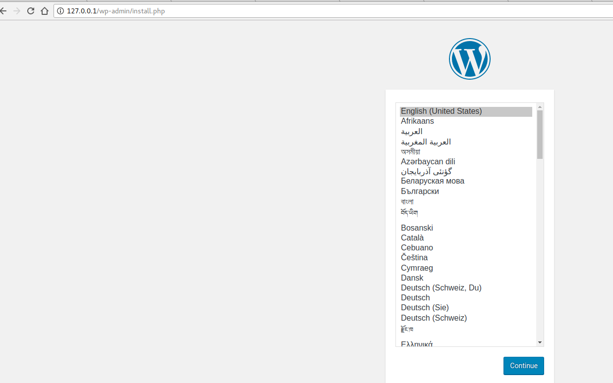

__Executando o primeiro Docker Compose__

Vamos agora executar a nossa receita de docker-compose

Para tal vá até a pasta onde você criou o arquivo docker-compose.yml e execure:
```
sudo docker-compose up
```
A saida esperada deve ser:
```
WARNING: Some networks were defined but are not used by any service: overlay
WARNING: The Docker Engine you're using is running in swarm mode.

Compose does not use swarm mode to deploy services to multiple nodes in a swarm. All containers will be scheduled on the current node.

To deploy your application across the swarm, use `docker stack deploy`.

Creating network "6dockercompose_default" with the default driver
Pulling mariadb (mariadb:latest)...
latest: Pulling from library/mariadb
aa18ad1a0d33: Already exists
fdb8d83dece3: Already exists
75b6ce7b50d3: Already exists
...
```
Ao final do processo será possivel acessar localmente o serviço do wordpress pelo browser no endereço 127.0.0.1
E a tela abaixo deve ser exibida:


Meu console ficou preso =/
```
Ctrl+C && \
sudo docker-compose up -d
```
E como monitoro agora?
```
sudo docker-compose ps
```
A saida deve ser:
```
WARNING: Some networks were defined but are not used by any service: overlay
           Name                         Command               State          Ports        
------------------------------------------------------------------------------------------
6dockercompose_mariadb_1     docker-entrypoint.sh mysqld      Up      3306/tcp            
6dockercompose_wordpress_1   docker-entrypoint.sh apach ...   Up      127.0.0.1:80->80/tcp
```

É possivel para os serviços? 
```
sudo docker-compose stop wordpress
```
A saida deve ser:
```
WARNING: Some networks were defined but are not used by any service: overlay
Stopping 6dockercompose_wordpress_1 ... done
```
Vamos verificar?
```
sudo docker-compose ps

WARNING: Some networks were defined but are not used by any service: overlay
           Name                         Command               State     Ports  
-------------------------------------------------------------------------------
6dockercompose_mariadb_1     docker-entrypoint.sh mysqld      Up       3306/tcp
6dockercompose_wordpress_1   docker-entrypoint.sh apach ...   Exit 0       
E como volto esse cara?
```

E como subo ele novamente?
```
sudo docker-compose start wordpress
```
A saida deve ser:
```
WARNING: Some networks were defined but are not used by any service: overlay
Starting wordpress ... done
```
Vamos verificar novamente?
```
sudo docker-compose ps
WARNING: Some networks were defined but are not used by any service: overlay
           Name                         Command               State          Ports        
------------------------------------------------------------------------------------------
6dockercompose_mariadb_1     docker-entrypoint.sh mysqld      Up      3306/tcp            
6dockercompose_wordpress_1   docker-entrypoint.sh apach ...   Up      127.0.0.1:80->80/tcp

```
Note que os dois serviços estão `UP`

E como limpo tudo?

```
sudo docker-compose down
```
A saída deve ser:
```
WARNING: Some networks were defined but are not used by any service: overlay
Stopping 6dockercompose_wordpress_1 ... done
Stopping 6dockercompose_mariadb_1   ... done
Removing 6dockercompose_wordpress_1 ... done
Removing 6dockercompose_mariadb_1   ... done
Removing network 6dockercompose_default
```
Vamos agora verificar uma ultima vez:
```
sudo docker-compose ps

WARNING: Some networks were defined but are not used by any service: overlay
Name   Command   State   Ports
------------------------------
```

Por enquando encerramos como Docker Compose =D, mas iremos revisitar esse cara para receitas mais rebuscadas alem de fazer uso da receita para fazer um deploy via `docker stack` que vai nos capacitar para ambientes produtivos